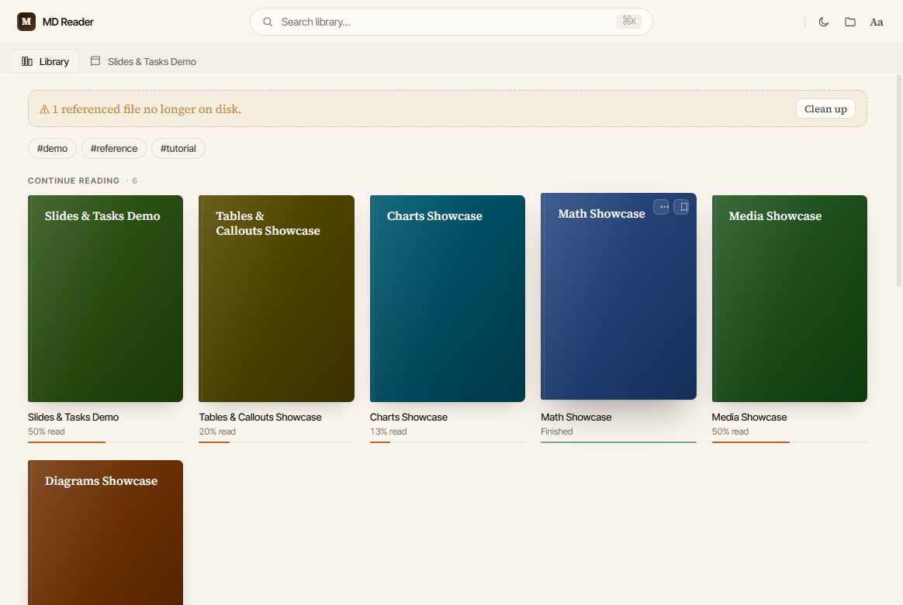
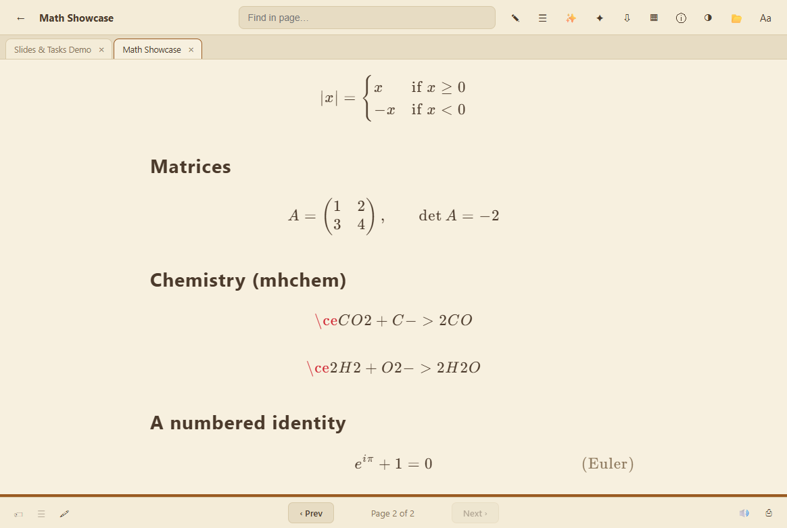
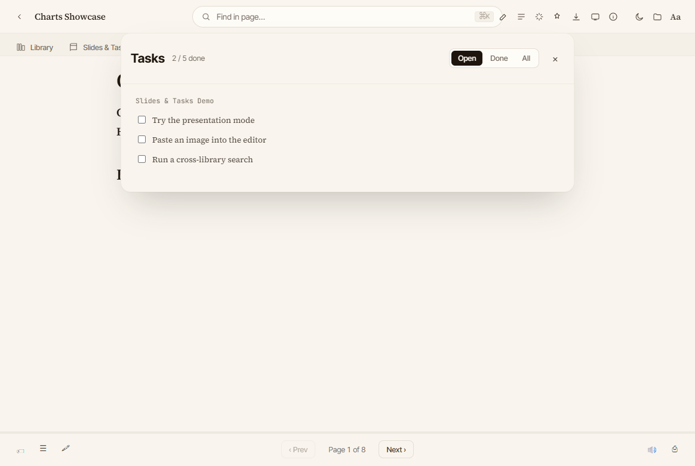
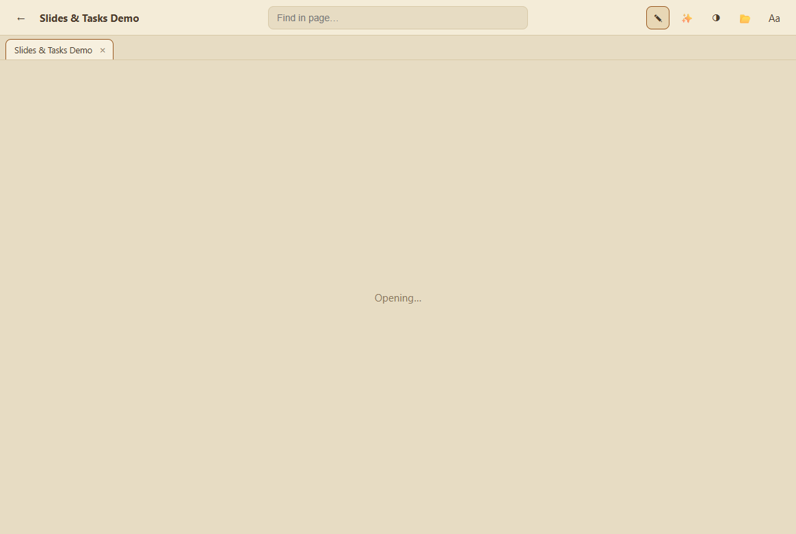
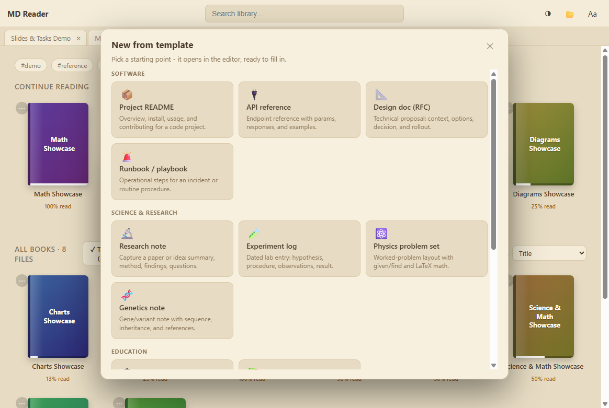

# MD Reader

A fast, private, offline-first **Markdown reader, library, and editor** for Windows — built for real technical, scientific, and study work. Render math, diagrams, and charts beautifully; organize a whole vault of notes; and (optionally) bring your own AI key for a study assistant — all in a secure Electron desktop app.

**[🌐 Website](https://malloythedev.github.io/MD-Reader/) · [⬇ Download](https://github.com/MalloyTheDev/MD-Reader/releases/latest) · [📜 Changelog](CHANGELOG.md)**



## Download

Grab the latest Windows installer from the [**Releases**](https://github.com/MalloyTheDev/MD-Reader/releases) page:

- **[md-reader-1.4.2-setup.exe](https://github.com/MalloyTheDev/MD-Reader/releases/latest)** — current release

Then launch **MD Reader** and point it at any folder of `.md` files, or use the built-in vault. See [Windows install notes](#windows-install-notes) below.

## Windows install notes

The installer is **not code-signed yet**, so Windows SmartScreen shows an _"unknown publisher"_
prompt the first time you run it. The app is open source — you can read every line here or build it
yourself. To install:

1. Run `md-reader-<version>-setup.exe`.
2. If SmartScreen appears, click **More info → Run anyway**.

Code signing is fully wired up (see [`SIGNING.md`](SIGNING.md)); the app will ship signed once a
certificate is in place, which removes the prompt.

## Features

### Reading

- Paginated, book-style reader with optional **two-page spread** and smooth page turns
- **Table of contents**, reading-progress %, **bookmarks**, and "continue reading"
- Themes (light / sepia / dark / nord) + deep **typography settings** (font, size, weight, spacing, width, margins, justification) and an optional focus ruler

### Rich Markdown

- GitHub-flavored Markdown with **KaTeX math** (per-equation _copy LaTeX_ / _expand_)
- **Mermaid diagrams** with zoom / pan / fullscreen / export (SVG · PNG) and a safe error panel
- Safe, dependency-free **charts** from a ` ```chart ` block (line · bar · pie · scatter · area)
- **Callouts** including science/engineering types (hypothesis, method, result, theorem, proof, quantum, genetics, …)
- **Wiki-links** `[[note]]` + backlinks, embeds `![[note]]`, image captions & click-to-zoom lightbox




### Library & navigation

- A managed **vault** plus the ability to open any folder; **Recent folders** menu so you can always switch back in one click — never lost
- **Search operators**: `tag:` `title:` `path:` `content:` `has:math|mermaid|chart|table|todo|image|code` with matched-line previews
- Tags, a force-directed **graph view**, **highlights + notes**, and **flashcards** with spaced repetition
- Safe file management — _Remove from Library_ (undoable) vs _Delete_ (to Recycle Bin), with confirmation

### Editor

- Live Markdown editor with a formatting toolbar, Notion-style **/ slash menu**, find & replace
- **CSV ↔ table** conversion, drag-and-drop image insertion, autosave option
- **Templates**: 15 curated scaffolds (README, API doc, research note, experiment log, physics problem set, lecture notes, meeting notes, project plan, and more)




### Document intelligence & export

- **Document info** panel: word/heading/equation/diagram/chart/table/task counts + broken-wiki-link health checks
- **Export** to HTML and Word — with math, Mermaid diagrams, and charts fully rendered — plus print/PDF

### AI (optional — bring your own key)

- Multi-provider (Anthropic, OpenAI, and OpenAI-compatible / Ollama)
- Study assistant (chat with a doc or the whole library), repurpose-a-doc, topic → course pack, README-from-source, and auto-organize (title/tags/links)
- API keys are stored **encrypted at rest** via the OS keychain (`safeStorage`) — never in plaintext

## Security & privacy

MD Reader is built defensively:

- `contextIsolation: true`, `nodeIntegration: false` — all filesystem/dialog/shell access lives in the main process behind a typed `window.api` bridge
- File access is **confined to the open library root** (`isInsideRoot` guard + filename sanitization)
- Deletes go to the **Recycle Bin**, never silently destroyed
- Remote images are **blocked by default**; Mermaid renders with `securityLevel: 'strict'` and SVG output is sanitized
- Charts run **no code** — they parse a static spec only
- Works fully **offline**; AI features only run when you add your own key

## Build from source

Requires Node.js 18+.

```bash
npm install          # install dependencies
npm run dev          # run in development
npm run typecheck    # TypeScript checks
npm test             # unit tests (vitest)
npm run build:win    # build the Windows installer → dist/ (unsigned unless a cert is configured)
```

## Tech stack

Electron · electron-vite · React 19 · TypeScript · react-markdown (remark/rehype) · KaTeX · Mermaid · MiniSearch · d3-force · electron-builder (NSIS).

## License

[MIT](LICENSE) © MalloyTheDev
