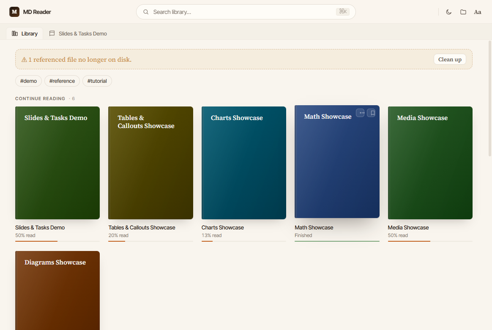
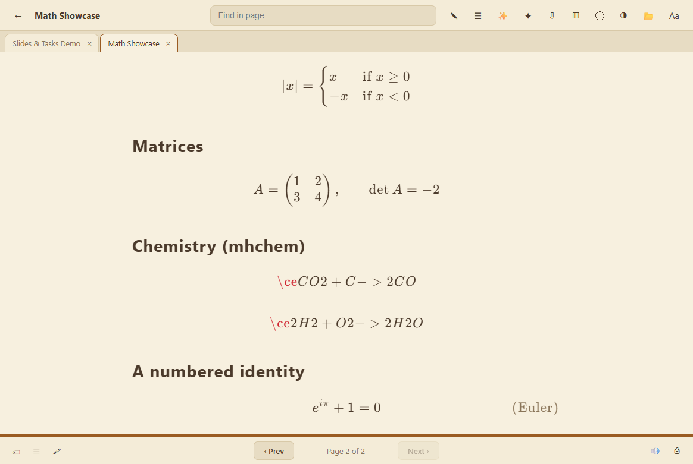
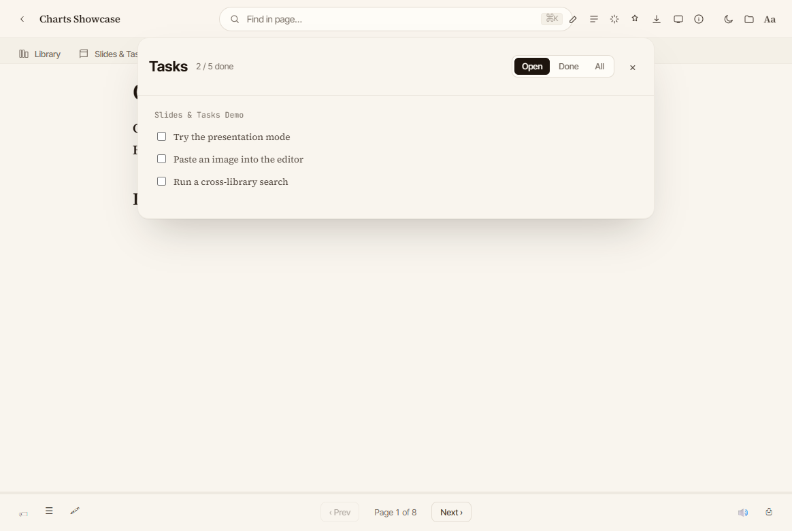
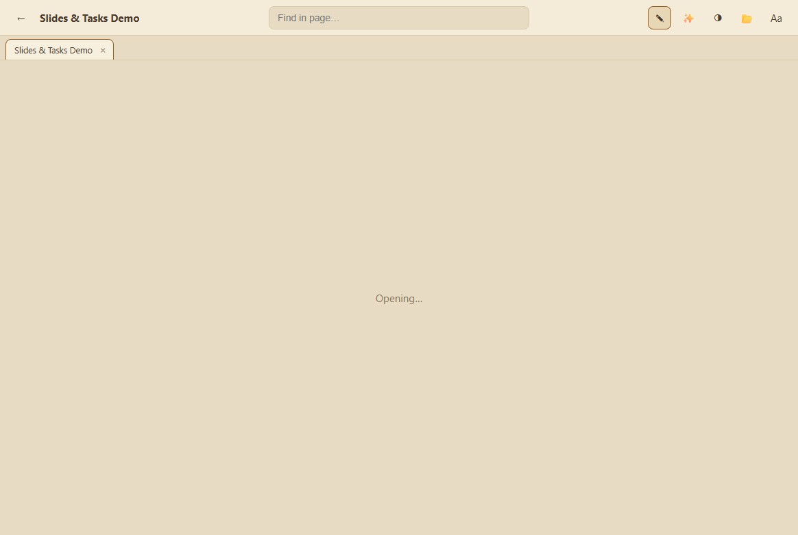
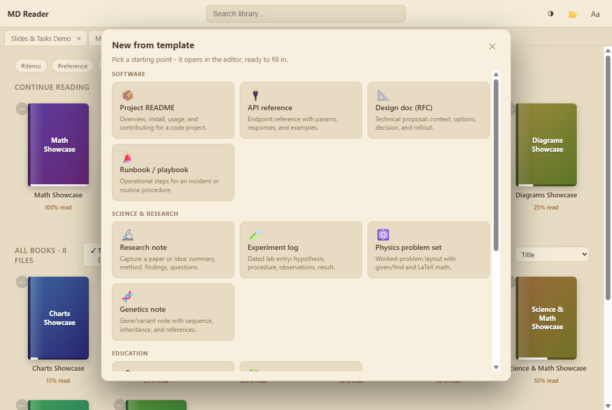
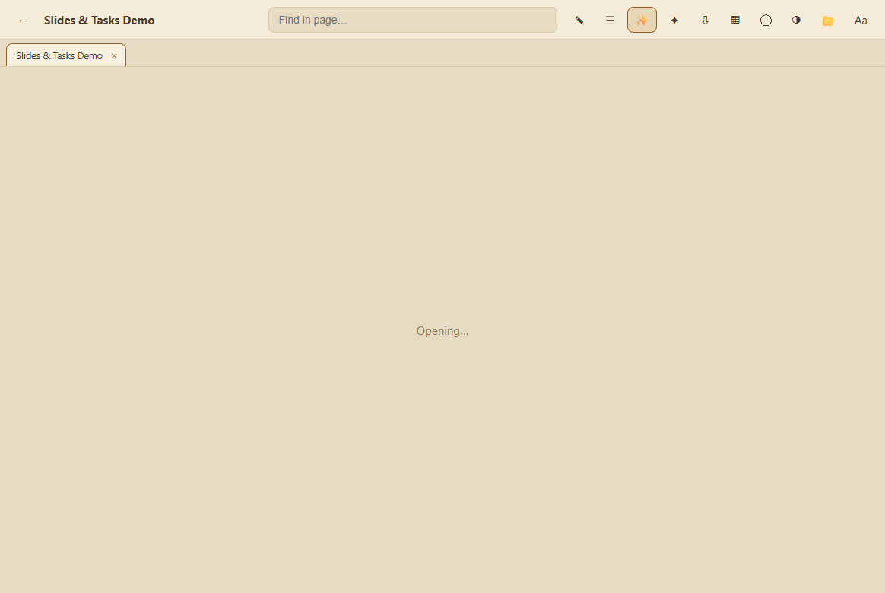

# MD Reader

A fast, private, offline-first **Markdown reader, library, and editor** for Windows - built for real technical, scientific, and study work. Render math, diagrams, and charts beautifully; organize a whole vault of notes; and (optionally) bring your own AI key for a study assistant - all in a secure Tauri desktop app (Rust backend + React renderer; legacy Electron build kept for reference).

**[🌐 Website](https://malloythedev.github.io/MD-Reader/) · [⬇ Download](https://github.com/MalloyTheDev/MD-Reader/releases/latest) · [📜 Changelog](CHANGELOG.md)**



## Download

Grab the latest Windows installer from the [**Releases**](https://github.com/MalloyTheDev/MD-Reader/releases) page:

- **MD-Reader-2.0.0-tauri-setup.exe** (or latest) - current Tauri release (recommended)

Then launch **MD Reader** and point it at any folder of `.md` files, or use the built-in vault. See [Windows install notes](#windows-install-notes) below.

## Windows install notes

The installer is **not code-signed yet**, so Windows SmartScreen shows an _"unknown publisher"_
prompt the first time you run it. The app is open source - you can read every line here or build it
yourself. To install:

1. Run `md-reader-<version>-setup.exe`.
2. If SmartScreen appears, click **More info → Run anyway**.

Code signing is fully wired up (see [`SIGNING.md`](SIGNING.md)); the app will ship signed once a
certificate is in place, which removes the prompt. (Current releases are unsigned; see Windows notes.)

## Tauri runtime notes (v2.0+)

MD Reader v2+ is a **Tauri** app:

- Primary shell is Tauri 2 (Rust) + the same React renderer.
- Run with `npm run tauri:dev` (or `npm run dev` now defaults to Tauri).
- Build with `npm run tauri:build`.
- Legacy Electron build is still available via `npm run dev:electron` / `build:electron` for reference or comparison.

**AI key migration**: Keys are now stored in the OS keyring (via the `keyring` crate). They do **not** migrate automatically from older Electron builds (which used `safeStorage`). You will need to re-enter your API keys the first time you use the Tauri version.

The security model reaches parity with the previous Electron version (path confinement, authorized roots, SSRF pinning for AI, etc.).

## Features

### Reading

- Paginated, book-style reader with optional **two-page spread** and smooth page turns
- **Table of contents**, reading-progress %, **bookmarks**, and "continue reading"
- Themes (light / sepia / dark / nord) + deep **typography settings** (font, size, weight, spacing, width, margins, justification) and an optional focus ruler
- Oversized code blocks, equations, and images **scroll within the page**, so nothing is clipped even at large font sizes

### Rich Markdown

- GitHub-flavored Markdown with **KaTeX math** (per-equation _copy LaTeX_ / _expand_)
- **Mermaid diagrams** with zoom / pan / fullscreen / export (SVG · PNG) and a safe error panel
- Safe, dependency-free **charts** from a ` ```chart ` block (line · bar · pie · scatter · area)
- **Callouts** including science/engineering types (hypothesis, method, result, theorem, proof, quantum, genetics, …)
- **Wiki-links** `[[note]]` + backlinks, embeds `![[note]]`, image captions & click-to-zoom lightbox




### Library & navigation

- A managed **vault** plus the ability to open any folder; **Recent folders** menu so you can always switch back in one click - never lost
- **Search operators**: `tag:` `title:` `path:` `content:` `has:math|mermaid|chart|table|todo|image|code` with matched-line previews
- Tags, a force-directed **graph view**, **highlights + notes**, and **flashcards** with spaced repetition
- Safe file management - _Remove from Library_ (undoable) vs _Delete_ (to Recycle Bin), with confirmation

### Editor

- Live Markdown editor with a formatting toolbar, Notion-style **/ slash menu**, find & replace
- **CSV ↔ table** conversion, drag-and-drop image insertion, autosave option
- **Templates**: 15 curated scaffolds (README, API doc, research note, experiment log, physics problem set, lecture notes, meeting notes, project plan, and more)




### Document intelligence & export

- **Document info** panel: word/heading/equation/diagram/chart/table/task counts + broken-wiki-link health checks
- **Export** to HTML and Word - with math, Mermaid diagrams, and charts fully rendered - plus print/PDF

### AI (optional - bring your own key)

- Multi-provider (Anthropic, OpenAI, and OpenAI-compatible / Ollama). The **model list is fetched live** from your provider, so new models show up automatically - with a Refresh button and an offline fallback
- Study assistant (chat with a doc or the whole library) plus one-click actions: **summarize, flashcards, study guide, quiz, key terms, ELI5, critique, extract action items**, and **text → Mermaid diagram or table**
- Transform a document: **repurpose** (one-pager · blog · exec summary · slides · lesson), **translate** to any language, **rewrite in a chosen tone**, topic → **course pack**, **README-from-source**, and **auto-organize** (title/tags/links)
- Resilient streaming (cancelable), adaptive thinking on Claude 4.x - and API keys are stored **encrypted at rest** via the OS keyring (keyring crate on Rust side), never in plaintext



## Security & privacy

MD Reader is built defensively:

- All privileged access (FS, dialogs, shell) lives in the Tauri Rust backend behind a typed `window.api` surface (implemented via `@tauri-apps/api` invoke).
- File access is **confined to the open library root** (lexical + canonicalize checks in Rust, `is_inside_root` guards).
- Deletes go to the **Recycle Bin** (via the `trash` crate), never silently destroyed.
- Remote images are **blocked by default**; Mermaid renders with `securityLevel: 'strict'` and SVG output is sanitized.
- Charts run **no code** - they parse a static spec only.
- Works fully **offline**; AI features only run when you add your own key (keys stored in OS keyring, never plaintext).
- Legacy Electron build (if used) had equivalent `contextIsolation` + preload hardening.

## Build from source

Requires Node.js 18+ and Rust (for Tauri).

```bash
npm install          # install dependencies
npm run dev          # run in development (Tauri by default)
npm run typecheck    # TypeScript checks
npm test             # unit tests (vitest)
npm run tauri:build  # build the Windows Tauri installer → src-tauri/target/... (unsigned)
# Legacy Electron: npm run dev:electron ; npm run build:electron
```

## Tech stack

Tauri 2 (Rust backend) · Vite (renderer) · React 19 · TypeScript · react-markdown (remark/rehype) · KaTeX · Mermaid · MiniSearch · d3-force · (Legacy: Electron + electron-vite + electron-builder).

## License

[MIT](LICENSE) © MalloyTheDev
