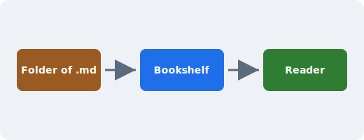

# The MD Reader Handbook

Welcome to **MD Reader** — a desktop app that turns a folder of Markdown files
into a comfortable, book-like reading experience. This sample library exists so
you can try every feature right away. Feel free to delete this `sample-library`
folder and point the app at your own notes, classwork, or documentation.

## What this app does

MD Reader scans a folder for `.md` files and shows them as a _bookshelf_. Open a
book and you can flip through it page by page, jump around with the table of
contents, search inside it, and read in light, sepia, or dark themes.

> Tip: use the arrow keys (or Page Up / Page Down) to turn pages, and click the
> left or right third of a page to flip with the mouse.

## Formatting it understands

It supports GitHub-Flavored Markdown, including tables, task lists, and
strikethrough.

| Feature        | Shortcut / where         | Notes                        |
| -------------- | ------------------------ | ---------------------------- |
| Turn page      | Arrow keys / click edges | Smooth animated flip         |
| Contents       | ☰ button (top right)    | Click a heading to jump      |
| Search in page | Search box while reading | Highlights and jumps to hits |
| Themes         | Aa button                | Light · Sepia · Dark         |

A short checklist:

- [x] Render Markdown
- [x] Paginate like a book
- [x] Table of contents
- [ ] Your own notes go here

Here is some inline `code`, a bit of ~~struck-through text~~, and a [link to
chapter one](chapter-1.md) that opens another file in this library.

## A code sample

```js
function greet(name) {
  // syntax highlighting comes from highlight.js
  return `Hello, ${name}!`
}
console.log(greet('reader'))
```

## An image



Continue to [Chapter 1: Getting Comfortable](chapter-1.md).
