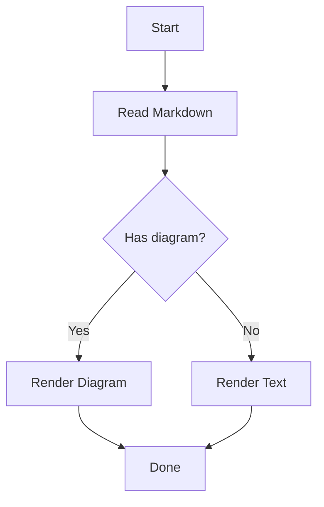
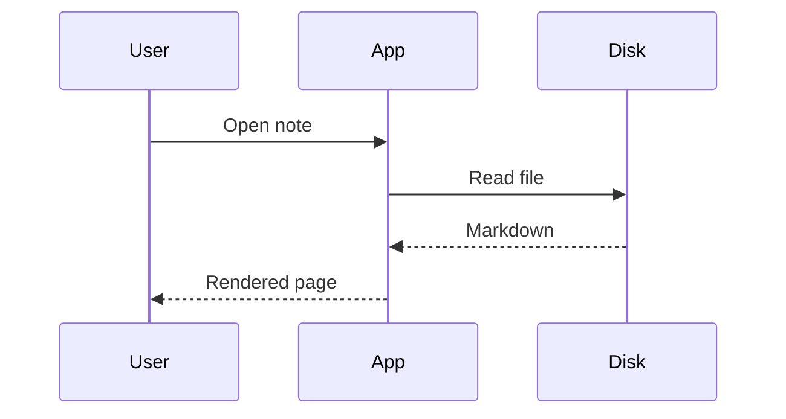
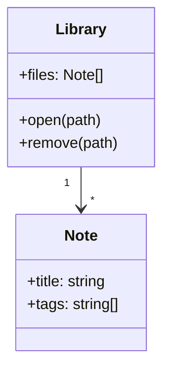
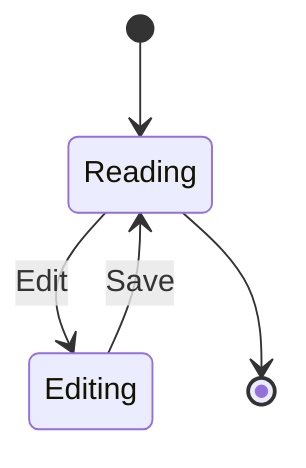
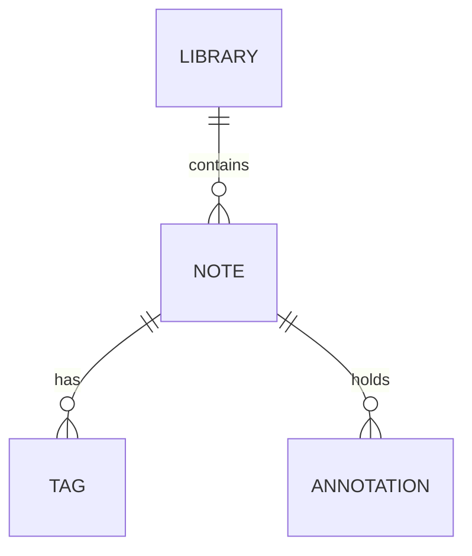
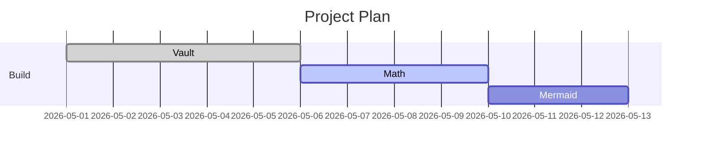
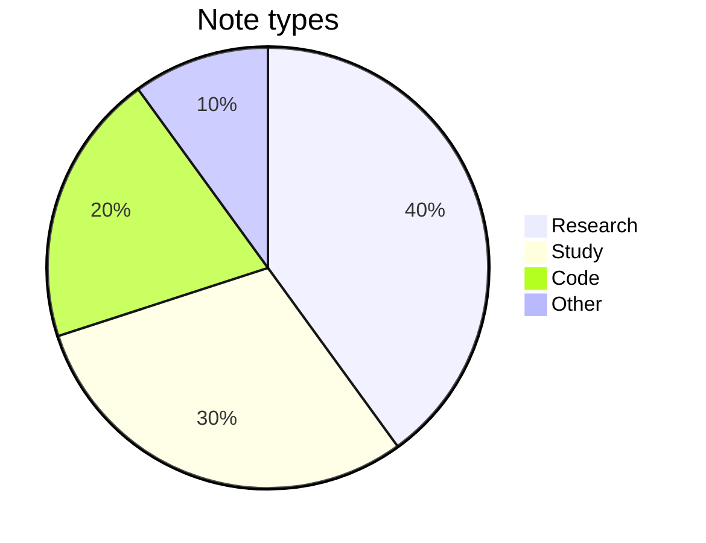
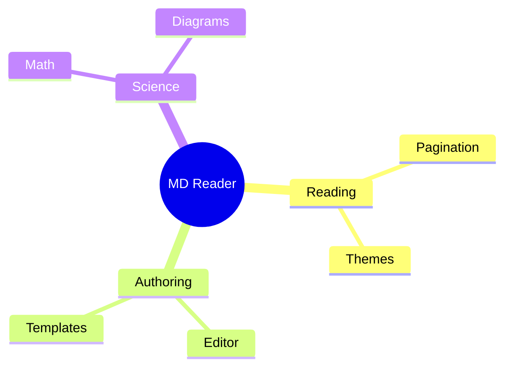

# Diagrams Showcase

Hover any diagram for its toolbar: **zoom**, **reset (⟲)**, **fullscreen (⛶)**, **Copy** source, and export **SVG**/**PNG**. Drag to pan; double-click to reset.

## Flowchart



## Sequence diagram



## Class diagram



## State diagram



## Entity relationship



## Gantt



## Pie



## Mindmap



## Error handling (intentional typo)

A broken diagram shows an error panel with the source — it never crashes the page:

```mermaid
graph TD
  A -->
  B[[[oops
```
