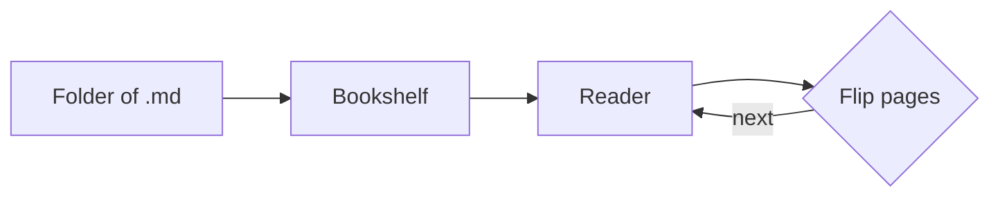

# Rich Content Showcase

This file shows off the richer rendering features. Its title and author come
from the YAML front-matter at the top (which is hidden from the page itself).

## Math

Inline math like $a^2 + b^2 = c^2$ renders right in the sentence, and display
math gets its own centered line:

$$\int_0^1 x^2 \, dx = \frac{1}{3} \qquad e^{i\pi} + 1 = 0$$

## A diagram

## A table

| Symbol    | Meaning      |
| --------- | ------------ |
| `$...$`   | inline math  |
| `$$...$$` | display math |
| `mermaid` | a diagram    |

## Images zoom

Click the diagram on the [handbook](../README.md) page to open it full-screen.

Everything here re-paginates correctly as you change the font size or window.

## Callouts & links

> [!tip] Study tip
> Link notes together with wiki-links and the graph view will map them.

> [!warning] Heads up
> The AI features send document text to the Anthropic API.

See also [[chapter-1]] and [[README]]. Tags: #demo #reference

## An embedded note

![[keyboard-shortcuts]]
